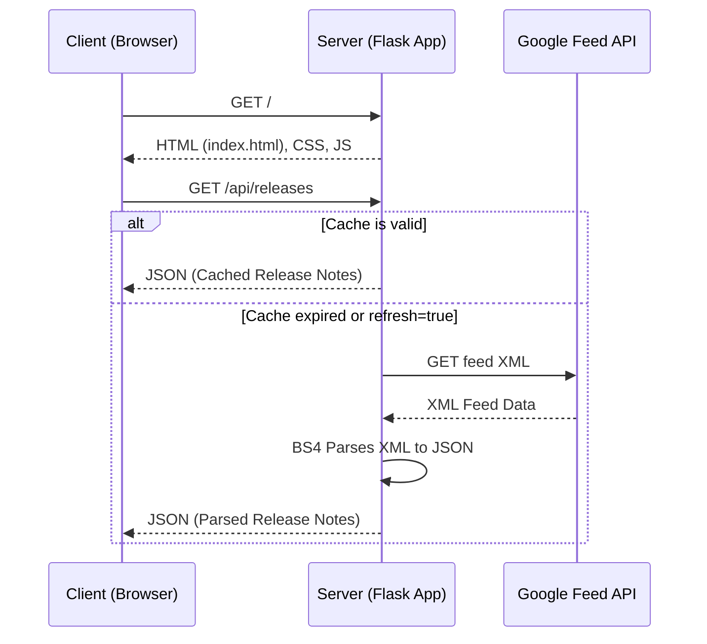

# BigQuery Release Notes Monitor & Share App

A premium, modern web dashboard built with **Python Flask** and **plain vanilla HTML, CSS, and JavaScript** that parses the official Google Cloud BigQuery Release Notes RSS/Atom feed and allows users to browse updates, search contents, filter by dynamic categories, and draft tweets to share them directly on Twitter (X).

---

## 🌟 Main Features

- **Dynamic Feed Fetching & Parsing**: Fetches the official Google Cloud BigQuery Atom feed, parsing namespace-specific elements into structured JSON objects.
- **In-Memory API Caching**: Cache duration is set to 30 minutes to reduce network overhead, with support for an immediate manual force-refresh.
- **Dynamic Category Count Pills**: Automatically scans categories present in the feed (e.g. `Feature`, `Issue`, `Announcement`, `Change`, `Breaking`, `Deprecation`) and displays them as filter pills with accurate counters.
- **Interactive Search and Filtering**: Instant client-side search by text across entries, dates, content body, and categories.
- **Interactive Tweet Draft Composer**:
  - Automatically compiles standard draft text with formatting template.
  - Normalizes and collapses duplicate whitespaces/newlines for clean visual spacing.
  - Keeps track of the strict 280-character limit with a reactive progress bar.
  - Generates a **Twitter Web Intent** link (`https://twitter.com/intent/tweet?text=...`) to publish on X.
  - Includes a local **Simulated Tweet Posting API** (`/api/tweet/simulate`) to test submissions without going live.
- **Premium Dark-Theme Aesthetics**: A sleek custom stylesheet featuring custom scrollbars, card entry boundaries, hover state transitions, and responsive layout adaptions.

---

## 🏗️ Architecture Breakdown

The project follows a standard client-server architecture:



### 1. Server-Side (Python Flask)
Located in [`app.py`](file:///C:/Users/Nidhi/agy-cli-projects/bq-release-notes/app.py), the backend serves the main page and two API endpoints:

- **Routing & Rendering**:
  - `index()` binds to `/` to serve the static landing page.
- **API Engine**:
  - `get_releases()` binds to `/api/releases` (supports `?refresh=true`). It manages the 30-minute in-memory cache and returns the structured JSON release notes.
  - `fetch_and_parse_feed()` fetches the remote Atom XML file, parses the XML namespace, and uses `BeautifulSoup` to isolate updates.
  - `simulate_tweet()` binds to `/api/tweet/simulate`. It processes a mock JSON post with a delay to simulate an API submission.

### 2. Client-Side (Vanilla JS, CSS & HTML)
Provides the presentation layer and front-end state management:

- **HTML Structure**: [`templates/index.html`](file:///C:/Users/Nidhi/agy-cli-projects/bq-release-notes/templates/index.html) contains semantic containers for the sidebar control panel, category pills container, chronological feed layout, modal popup, and toast notification container.
- **JavaScript Engine**: [`static/js/app.js`](file:///C:/Users/Nidhi/agy-cli-projects/bq-release-notes/static/js/app.js) manages:
  - State variables: `allReleases`, `activeCategory`, `searchQuery`, `currentSelectedUpdate`.
  - Event listeners for inputs, filters, and modals.
  - Dynamic card rendering with customized style bindings for category badge colors.
  - Character counter logic and tweet compilation.
- **CSS Design System**: [`static/css/style.css`](file:///C:/Users/Nidhi/agy-cli-projects/bq-release-notes/static/css/style.css) handles typography, variables for categories, responsive media rules, animations (`toastIn`, `slideUp`), and glassmorphism.

---

## 🔄 Sample Request-Response Flow: Fetching Release Notes

Here is a step-by-step trace of how data flows through the application when a user loads the page or clicks **Refresh Feed**:

1. **User Action**: The user clicks the **Refresh Feed** button.
2. **Client Request**: The JavaScript function `fetchReleases(true)` is called, which fires an asynchronous `fetch('/api/releases?refresh=true')` request to the Flask server.
3. **Server Controller**: The Flask route `@app.route('/api/releases')` catches the request.
4. **Feed Fetch & Parse**:
   - The server calls `fetch_and_parse_feed()` which executes a `requests.get()` to Google's XML feed URL.
   - The server parses the response using Python's `xml.etree.ElementTree` to loop through `<atom:entry>` elements.
   - For each entry, it parses HTML content inside `<atom:content>` using `BeautifulSoup`. It splits elements on `<h3>`/`<h4>` headings to extract sub-sections (e.g. Features vs Issues) and cleans up anchor tags to open in target `_blank`.
5. **Server Response**: The server updates its local memory cache with the timestamp and returns a JSON response:
   ```json
   {
     "releases": [
       {
         "date": "June 17, 2026",
         "link": "https://docs.cloud.google.com/bigquery/docs/...#June_17_2026",
         "sections": [
           {
             "id": "june_17,_2026_feature_0",
             "type": "Feature",
             "html": "<p>You can enable autonomous embedding generation...</p>",
             "text": "You can enable autonomous embedding generation..."
           }
         ],
         "updated": "2026-06-17T00:00:00-07:00"
       }
     ],
     "cached": false,
     "last_fetched": 1781831663.0
   }
   ```
6. **Client Render**:
   - `app.js` processes the JSON response.
   - It calls `renderFilterPills()` to aggregate total category statistics and update the filter list counts dynamically.
   - It calls `renderTimeline()` to filter, sort, and inject the clean HTML block elements into `#feed-content`.
   - The user sees a confirmation toast: `"Feed refreshed successfully!"`

---

## 🚀 Setup & Execution

### Prerequisites
- Python 3.8+
- Git

### Installation
1. Clone the repository and navigate to the project directory:
   ```bash
   git clone https://github.com/nidhisalvi651-collab/antigravity-event-talks-app.git
   cd antigravity-event-talks-app
   ```
2. Install Python requirements:
   ```bash
   pip install -r requirements.txt
   ```
3. Run the development server:
   ```bash
   python app.py
   ```
4. Access the web app in your browser at **[http://127.0.0.1:5000](http://127.0.0.1:5000)**.
